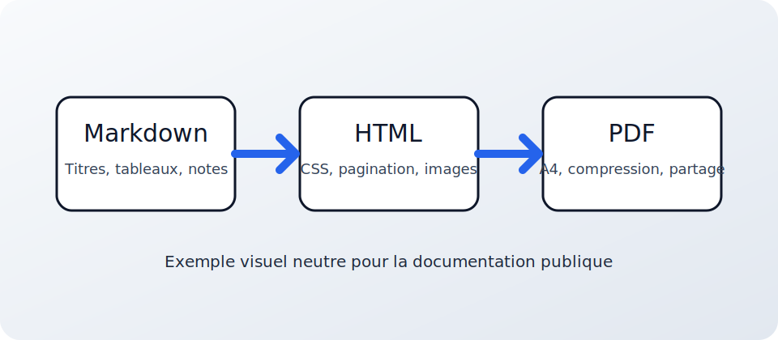

# Nectar Render Feature Showcase

This document demonstrates every feature supported by the converter. Open it in the app, pick a preset, and export to **PDF+HTML** to see it all in action.

---

## Typography

Regular text with **bold**, *italic*, ***bold italic***, `inline code`, and ~~strikethrough~~.

### Third-Level Heading

#### Fourth-Level Heading

##### Fifth-Level Heading

###### Sixth-Level Heading

---

## Lists

### Unordered

- Markdown parsing with extensions
- Syntax highlighting via Pygments
  - Seven built-in themes
  - Light and dark options
- PDF compression (optional)

### Ordered

1. Select a Markdown file
2. Choose an output format
   1. PDF only
   2. HTML only
   3. PDF + HTML
3. Click **Convert**

### Task List

- [x] Core conversion pipeline
- [x] Live HTML preview
- [x] Built-in presets
- [ ] Custom page sizes

---

## Blockquotes

> A well-structured document converts cleanly to PDF.

> **Nested blockquote:**
>
> > Inner content with `inline code` and emphasis.

---

## Tables

| Feature | Status | Description |
|---|---|---|
| Markdown to HTML | Stable | Core parsing with footnotes and page breaks |
| HTML to PDF | Stable | Rendered via WeasyPrint |
| Code highlighting | Stable | 7+ themes via Pygments |
| Obsidian embeds | Stable | `![[image.png]]` syntax supported |
| PDF compression | Optional | Requires qpdf for best results |
| Built-in presets | New | Academic, Modern, Technical, Minimal, Dark Code |

---

## Code Blocks

### Python

```python
from dataclasses import dataclass
from pathlib import Path


@dataclass
class Document:
    title: str
    path: Path
    page_count: int = 0

    def summary(self) -> str:
        return f"{self.title} ({self.page_count} pages)"


docs = [Document("Report", Path("report.md"), 12)]
for doc in docs:
    print(doc.summary())
```

### JavaScript

```javascript
async function convertMarkdown(filePath) {
  const content = await fs.readFile(filePath, "utf-8");
  const html = marked.parse(content);
  return { html, wordCount: content.split(/\s+/).length };
}
```

### JSON Configuration

```json
{
  "preset": "Modern",
  "style": {
    "body_font": "Segoe UI",
    "code_theme": "default",
    "margin_mm": 25.4
  }
}
```

### SQL

```sql
SELECT p.name, COUNT(*) AS exports
FROM presets p
JOIN conversions c ON c.preset_id = p.id
GROUP BY p.name
ORDER BY exports DESC;
```

### Bash

```bash
#!/usr/bin/env bash
python -m venv .venv
source .venv/bin/activate
pip install -e ".[dev]"
pytest -q
```

<!-- pagebreak -->

## Images

### Relative Path



### Obsidian Embed

![[sequence.svg|Architecture Sequence Diagram]]

---

## Footnotes

Footnotes appear inline in PDF output and as a list at the end in HTML[^rendering]. The marker color and text color are both configurable in the UI[^styling].

[^rendering]: WeasyPrint uses CSS `float: footnote` for proper placement on each page.
[^styling]: Open the **Footnotes** panel in the app to adjust sizes and colors.

---

## Page Break Markers

Three equivalent syntaxes produce a page break:

- `<!-- pagebreak -->` (HTML comment)
- `\pagebreak` (LaTeX style)
- `[[PAGEBREAK]]` (Wiki style)

\pagebreak

## Pagination Classes

### Keep With Next {.keep-with-next}

This heading uses `.keep-with-next` to stay attached to the content below it, avoiding orphaned headings at the bottom of a page.

- Item A
- Item B
- Item C

### Keep Together {.keep-together}

This block uses `.keep-together` to prevent page breaks inside it. Useful for short lists or small tables that should not be split across pages.

[[PAGEBREAK]]

## Final Notes

This document covers headings (H1-H6), text formatting, lists (unordered, ordered, tasks), blockquotes, tables, code blocks in five languages, images (relative and Obsidian embeds), footnotes, all three page break syntaxes, and pagination classes.

Try converting it with each built-in preset to compare the output styles.
